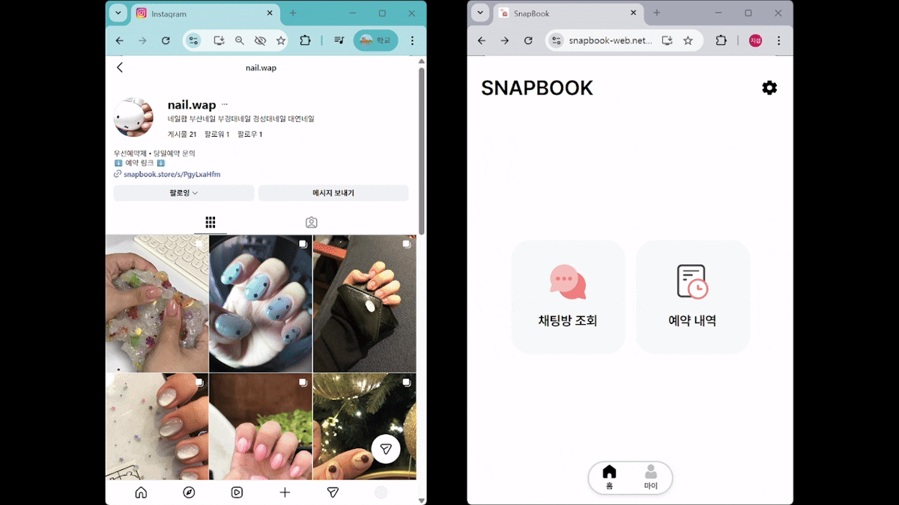
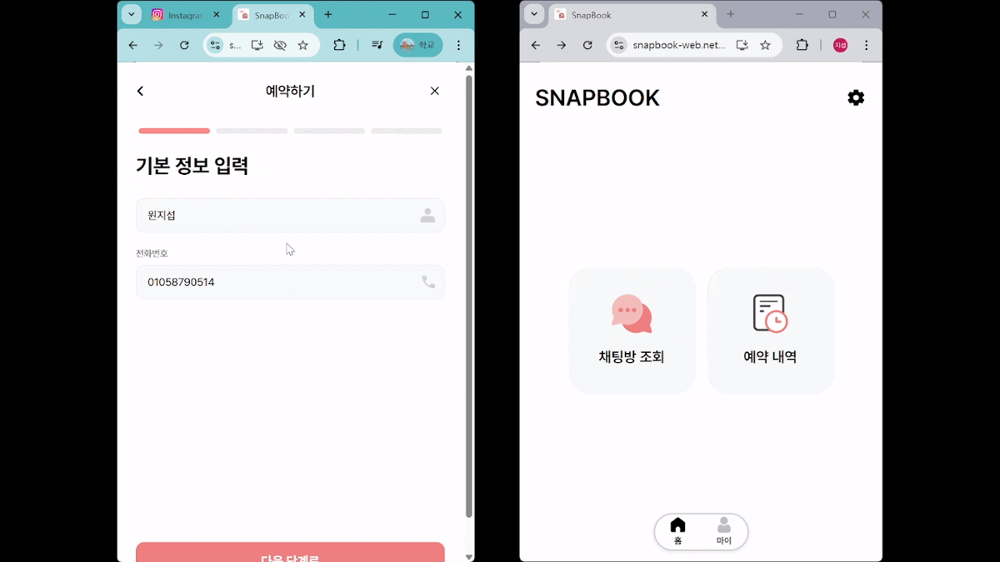
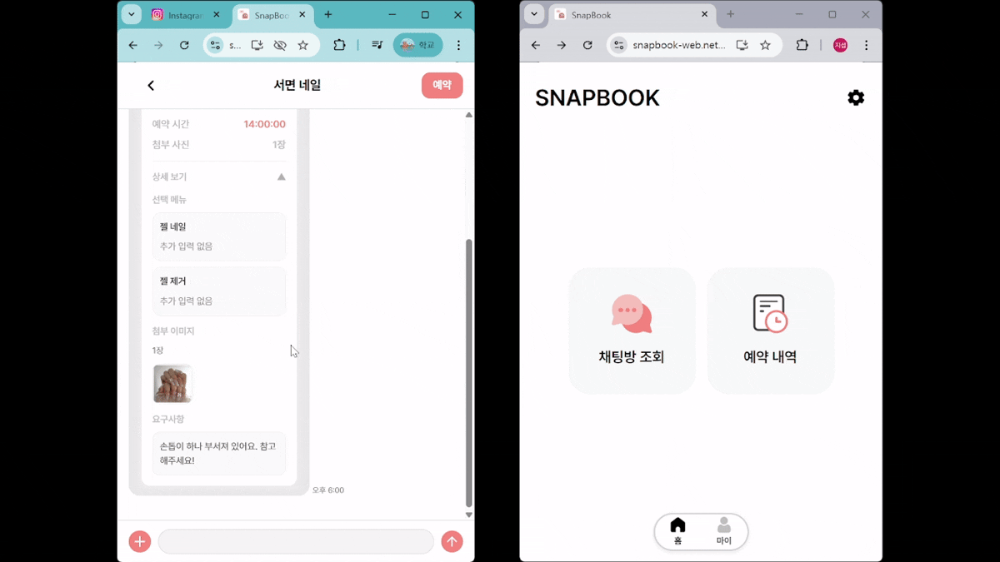
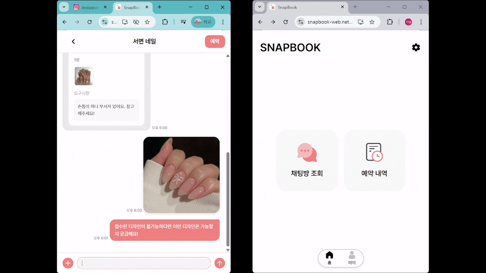
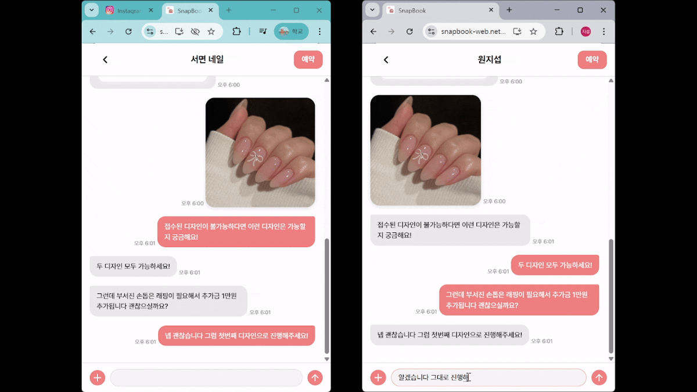
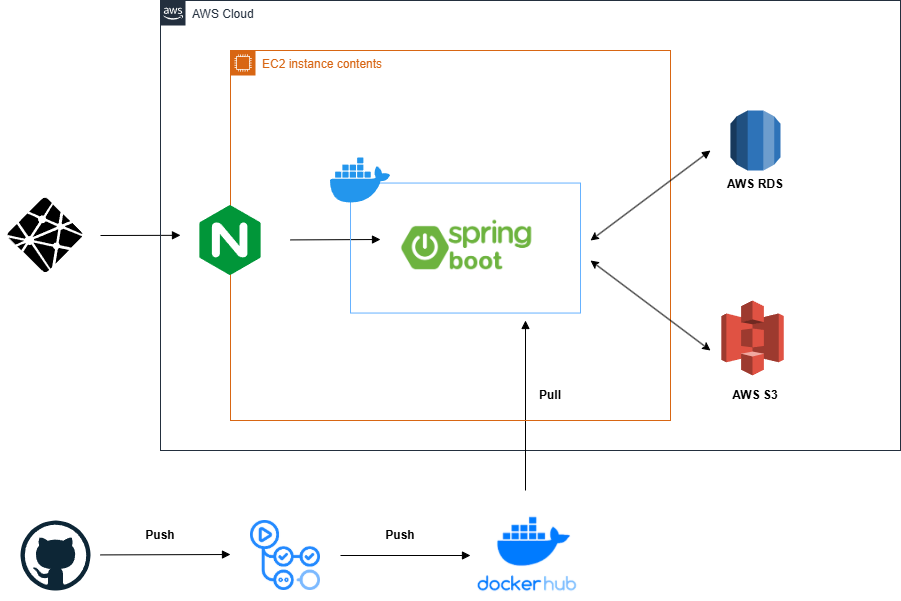

# SnapBook

> **예약과 문의를 채팅에서 한 번에!**  
> 네이버 예약·카톡으로 흩어져 있던 예약과 문의를, 한 곳의 채팅방에서 관리할 수 있게 해주는 서비스입니다.

---

## 서비스 개요

네이버 예약, 카카오톡 등 흩어져 있던 예약 과정을 통합하는 예약 관리 서비스입니다.  
SnapBook의 핵심은 예약, 상담, 사진 공유를 한 화면에서 관리할 수 있는 것입니다.  
여러 채널을 오가며 정보를 정리하지 않아도 되어 혼선을 줄일 수 있습니다.

---

## 배포 링크

https://snapbook.store/s/PgyLxaHfm (고객용)

---

## 시연

### SNS 링크 접속 시 예약 페이지 자동 진입

 

### 예약 과정

 

### 상담 과정

 
 

### 예약 처리 과정

 

---

## 주요 화면

   
<b>주요 화면 뷰 토글</b>

   

       
       
       
     
   

---

## 핵심 기능

1. **매장 예약 링크 접속**
    - 인스타그램 프로필 링크 **SnapBook 예약 링크**를 클릭해 진입합니다.

2. **채팅방 접속**
    - 매장별 전용 **채팅방**이 생성되어, 고객은 일반 메신저처럼 메시지를 남길 수 있습니다.

3. **채팅방에서 바로 예약**
    - 채팅방 안에서 바로 **예약 폼**을 작성하여 예약을 접수합니다.
    - 날짜/시간/메뉴 선택과 함께, 원하는 스타일 사진을 **이미지 업로드**로 간편하게 전송할 수 있습니다.

4. **예약 확인 메시지**
    - 사장님이 예약을 **확정 / 거절**하면,
    - 그 결과가 **예약 상태 메시지 카드**로 채팅방에 표시되어  
      고객이 예약 현황을 한눈에 확인할 수 있습니다.

---

## 아키텍처

