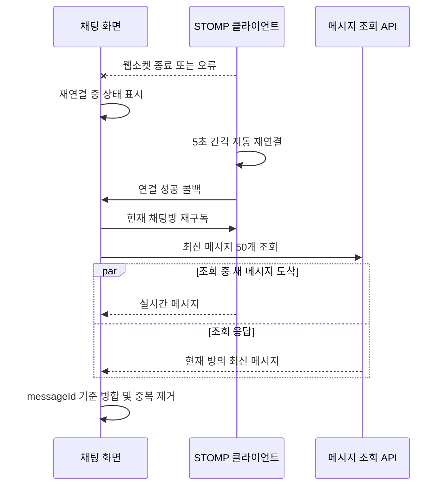
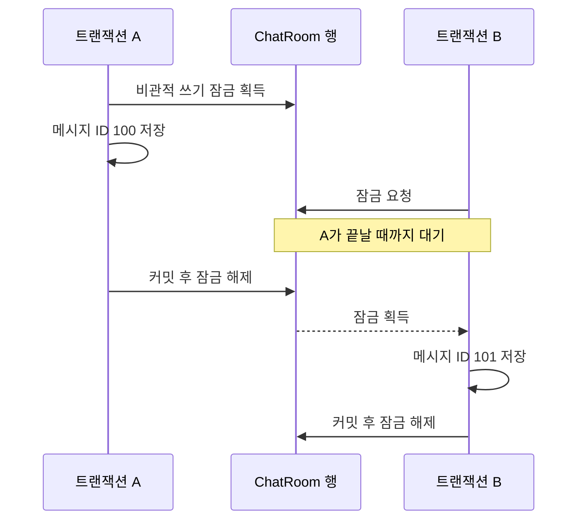
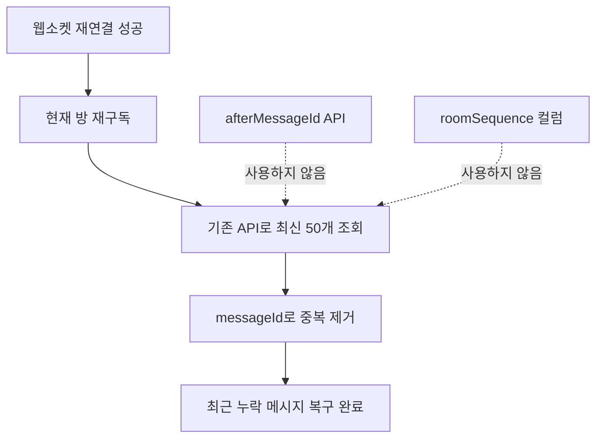

# 채팅 재연결 복구 흐름 그림

## 재연결 이후 최신 메시지 복구

재구독이 최신 조회보다 먼저다. 따라서 조회 중 새 메시지는 웹소켓으로 받을 수 있다. 같은 메시지가 두 경로로 들어와도 `messageId`가 같으면 하나만 남긴다.

## 같은 방 메시지의 저장 순서

같은 채팅방의 메시지는 방 행 잠금으로 저장과 커밋 순서가 직렬화된다. 다른 채팅방은 다른 행을 사용하므로 서로 기다리지 않는다.

## 선택한 방식과 제외한 방식

전역 메시지 ID의 빈 구간은 문제가 아니다. 최신 조회는 항상 현재 채팅방으로 제한된다. 대신 최근 누락이 50개를 넘지 않는다는 가정을 명시적으로 받아들이며, 이 가정이 바뀌면 페이지 반복 조회나 방별 연속 번호를 다시 검토한다.
